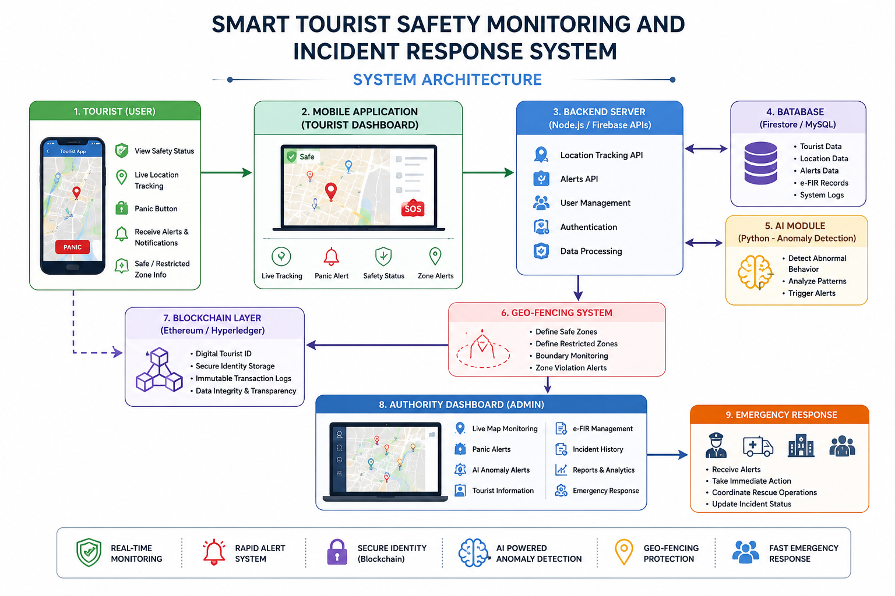
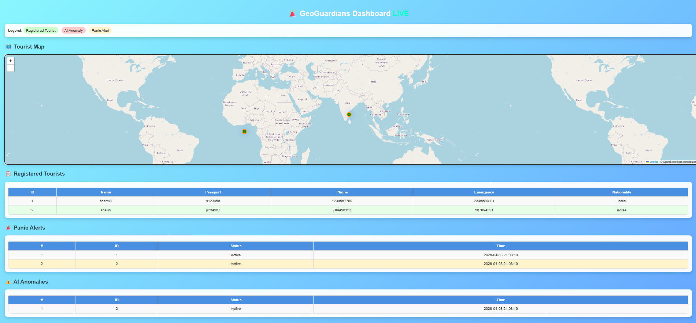
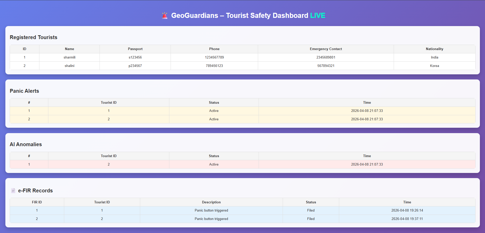
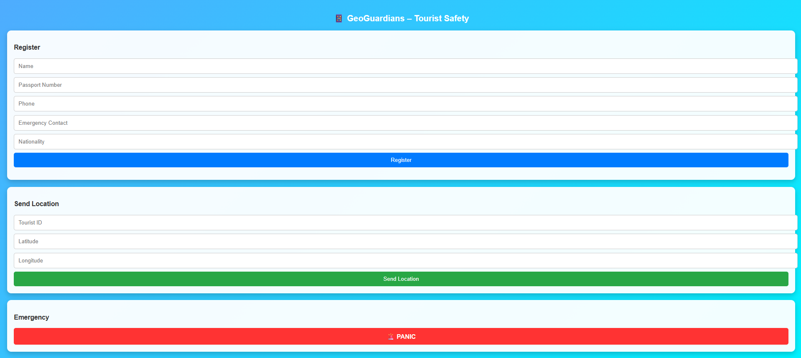

# Smart Tourist Safety Monitoring and Incident Response System

 Live demo / prototype showcasing real-time monitoring and alert system

⭐ A real-time AI-powered system for enhancing tourist safety using smart monitoring and rapid incident response.

---

##  Overview

The Smart Tourist Safety Monitoring and Incident Response System is a technology-driven solution designed to enhance tourist safety using real-time monitoring, secure identity verification, and rapid emergency response.

This system integrates AI, Blockchain, Geo-fencing, and Mobile Technologies to create a unified safety ecosystem for travelers.

---

##  Problem Statement

Tourists often face risks such as:

* Theft and fraud
* Entering unsafe or restricted areas
* Missing-person situations
* Delayed emergency response

Existing systems are fragmented and lack real-time coordination, leading to slower response and increased risk.

---

##  Proposed Solution

This system provides a centralized safety platform with:

* Real-time location monitoring
* AI-based anomaly detection
* Blockchain-based digital identity
* Emergency alert and response system

---

##  System Architecture

The system consists of:

* Mobile application (Tourist Interface)
* Backend server (APIs & data processing)
* AI anomaly detection module
* Geo-fencing system
* Authority monitoring dashboard
* Blockchain identity layer
  
##  System Architecture


---

##  Key Features

*  Real-time location tracking
*  Panic button for emergency alerts
*  AI-based anomaly detection
*  Blockchain-secured digital identity
*  Geo-fencing for unsafe zones
*  Authority dashboard with e-FIR support

---

##  Working Process

1. Tourist registers and receives a digital ID
2. Location tracking is enabled
3. Geo-fencing monitors safe/unsafe zones
4. AI detects abnormal behavior
5. Alerts are sent during emergencies
6. Authorities respond using dashboard

---

##  Tech Stack

* **Frontend:** HTML, CSS, JavaScript, Android
* **Backend:** Node.js, Firebase
* **Database:** Firestore, MySQL
* **AI Module:** Python (Anomaly Detection)
* **Blockchain:** Ethereum / Hyperledger
* **Maps & Location:** Google Maps API

---

##  Screenshots

###  Live Map Dashboard



###  Panic Alerts & AI Anomalies



### Tourist Dashboard



---

## How to Run

1. Clone the repository
2. Start backend server (Node.js / Flask)
3. Ensure APIs are running:

   * /tourists
   * /alerts
   * /locations
4. Open `authority-dashboard.html` in browser
5. Open `tourist-dashboard.html` for user interface

---

## 📁 Project Structure

```
smart-tourist-safety-system/
 ├── frontend/
 │    ├── authority-dashboard.html
 │    ├── tourist-dashboard.html
 │    └── dashboard-ui.html
 │
 ├── screenshots/
 │    ├── map-dashboard.png
 │    ├── alerts.png
 │    └── tourist-ui.png
 │
 ├── README.md
```

---

##  User Interfaces

###  Authority Dashboard

* Monitor tourists in real-time
* View panic alerts and AI anomalies
* Track locations on live map
* Access e-FIR records

###  Tourist Dashboard

* View safety status
* Receive alerts and warnings
* Trigger emergency panic button
* Navigate safe and restricted zones

---

##  Expected Outcomes

* Faster emergency response
* Improved tourist safety
* Secure identity verification
* Reduced crime risks

---

##  Advantages

* Real-time monitoring
* Faster response time
* Secure and tamper-proof identity
* Intelligent threat detection

---

##  Limitations

* Requires internet connectivity
* Privacy concerns with continuous tracking
* High implementation cost
* AI accuracy depends on training data

---

##  Future Scope

* Smart city integration
* Facial recognition for missing persons
* Multi-language support
* Wearable safety devices
* Global deployment

---

## Project Highlights

* Multi-user system (Tourist + Authority)
* Real-time monitoring dashboard
* AI-powered anomaly detection
* Blockchain-based identity security
* Interactive map with alerts

---

##  Note

This project is a prototype demonstrating the integration of AI, Blockchain, and Geo-fencing technologies for enhancing tourist safety systems.

---

##  Author

**Sharmili P.**

---

⭐ If you found this project interesting, feel free to star the repository!
